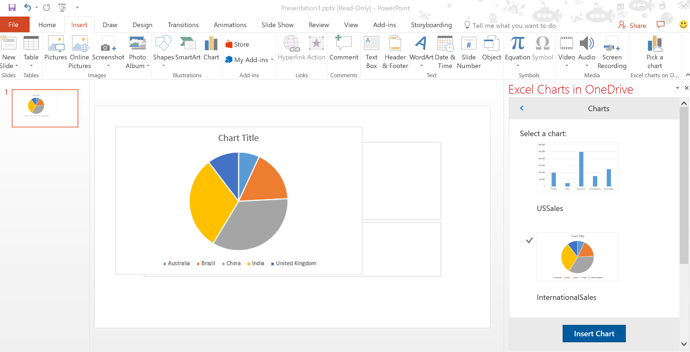

 Inserir gráficos do Excel usando o Microsoft Graph em um Suplemento do PowerPoint 

Saiba como criar um Suplemento do Microsoft Office que se conecta ao Microsoft Graph, localiza todas as pastas de trabalho armazenadas no OneDrive for Business, busca todos os gráficos nas pastas de trabalho usando as APIs REST do Excel e insere a imagem de um gráfico em um slide do PowerPoint usando Office.js.

## Introdução

A integração de dados de provedores de serviço online aumenta o valor e a adoção de seus suplementos. O código a seguir mostra como conectar seu suplemento ao Microsoft Graph. Use este exemplo de código para:

* Conectar-se ao Microsoft Graph a partir de um Suplemento do Office.
* Use a Biblioteca do MSAL .NET para implementar a estrutura de autorização do OAuth 2.0 em um suplemento.
* Use o Excel e as APIs REST do OneDrive no Microsoft Graph.
* Exiba uma caixa de diálogo usando o namespace da interface do usuário do Office.
* Crie um Suplemento usando ASP.NET MVC, MSAL e Office.js. 
* Use comandos de suplemento no PowerPoint.

## Pré-requisitos

Para executar este exemplo de código, são necessários.

* Visual Studio 2019 ou posterior.

* SQL Server Express (não é mais instalado automaticamente com versões recentes do Visual Studio).

* Uma conta do Office 365 que você pode obter ingressando no [Programa para Desenvolvedores do Office 365](https://aka.ms/devprogramsignup) que inclui uma assinatura gratuita de 1 ano do Office 365.

* Pastas de trabalho (com gráficos) do Excel armazenadas no OneDrive for Business em sua assinatura do Office 365.

* PowerPoint para Windows Desktop, versão 16.0.6769.2001 ou superior.
* [Ferramentas para Desenvolvedores do Office](https://www.visualstudio.com/en-us/features/office-tools-vs.aspx)

* Um Locatário do Microsoft Azure. Este suplemento requer o Azure Active Directiory (AD). O Active AD fornece serviços de identidade que os aplicativos usam para autenticação e autorização. Você pode adquirir uma assinatura de avaliação aqui: [Microsoft Azure](https://account.windowsazure.com/SignUp).

## Configurar o projeto

1. No **Visual Studio**, escolha o projeto **PowerPoint-Add-in-Microsoft-Graph-ASPNET-InsertChartWeb**. Em **Propriedades**, certifique-se de que o **SSL Habilitado** seja **True**. Verifique se a **URL do SSL** usa o mesmo nome de domínio e número de porta que os listados na etapa 3 abaixo.
 
2. Certifique-se de que a sua assinatura do Azure esteja vinculada ao locatário do Office 365. Para saber mais, confira a postagem de blog da equipe do Active Directory: [Criar e gerenciar vários diretórios do Microsoft Azure Active Directory](http://blogs.technet.com/b/ad/archive/2013/11/08/creating-and-managing-multiple-windows-azure-active-directories.aspx). A seção **Adicionando um novo diretório** explica como fazer isso. Para saber mais, confira o artigo [Configurar o ambiente de desenvolvimento do Office 365](https://msdn.microsoft.com/office/office365/howto/setup-development-environment#bk_CreateAzureSubscription) e a seção **Associar uma conta do Office 365 ao Azure AD para criar e gerenciar aplicativos**.

3. Registre o seu aplicativo usando o [Portal de Gerenciamento do Azure](https://manage.windowsazure.com). Entre com a conta de um administrador ou a sua assinatura do Office 365. Para aprender como registrar aplicativos, confira [Registrar um aplicativo na Microsoft Identity Platform](https://msdn.microsoft.com/office/office365/HowTo/add-common-consent-manually). Use as seguintes configurações:

 - REDIRECIONE O URI: https://localhost:44301/AzureADAuth/Authorize	
 - TIPOS DE CONTA COM SUPORTE: “Apenas contas neste diretório organizacional”
 - CONCESSÃO IMPLÍCITA: Não ative nenhuma opção de Concessão Implícita
 - PERMISSÕES DE API: **Files.Read.All** e **User.Read**

	> Observação: Após registrar o seu aplicativo, copie a **ID do Aplicativo (cliente)** e a **ID do Diretório (locatário)** na folha **Visão geral** do Registro de Aplicativo no Portal de Gerenciamento do Azure. Ao criar o segredo do cliente na folha **Certificados e segredos**, copie-o também. 
	 
4.  No web.config, use os valores que você copiou na etapa anterior. Defina **AAD: ClientID** como ID do cliente, defina **AAD: ClientSecret** como segredo do cliente e defina **"AAD: O365TenantID"** como ID do locatário. 

## Executar o projeto
1. Abra o arquivo de solução do Visual Studio. 
2. Clique com o botão direito do mouse em **PowerPoint-Add-in-Microsoft-Graph-ASPNET-InsertChart** e escolha **Definir como Projeto de Inicialização**.
2. Pressione F5. 
3. No PowerPoint, abra a guia **Inserir** e selecione **Escolher um gráfico** para abrir o suplemento do painel de tarefas.

## Problemas conhecidos

* Situação: Ao tentar executar o exemplo de código, o suplemento não será carregado.
	* Resolução: 
		1. No Visual Studio, abra o **Pesquisador de Objetos do SQL Server**.
		2. Expanda **(localdb) \\MSSQLLocalDB** > **Bancos de Dados**.
		3. Clique com o botão direito do mouse em **PowerPoint-Add-in-Microsoft-Graph-ASPNET-InsertChart** e escolha **Excluir**. 
* Cenário: Quando você executa o código de exemplo, você recebe um erro na linha *Office.context.ui.messageParent*.	
	* Resolução: Interrompa a execução do código de exemplo e reinicie-o. 
* Se baixar o arquivo zip, ao extrair os arquivos, você receberá um erro indicando que o caminho do arquivo é muito longo.
	* Resolução: Descompacte os arquivos em uma pasta diretamente na raiz (por exemplo, c:\\exemplo).

## Perguntas e comentários
Gostaríamos de receber o seu comentário sobre o exemplo de *Inserir gráficos do Excel usando o Microsoft Graph em um Suplemento do PowerPoint*. Você pode enviar comentários na seção *Problemas* deste repositório. Perguntas sobre o desenvolvimento do Office 365 em geral devem ser postadas no [Stack Overflow](http://stackoverflow.com/questions/tagged/Office365+API). Certifique-se de que as suas perguntas estejam marcadas com \[office-js], \[MicrosoftGraph] e \[API].

## Recursos adicionais

* [Exemplo de código de Tarefas Pendentes do Microsoft Graph (Excel)](https://github.com/microsoftgraph/aspnet-todo-rest-sample)
* [Documentação do Microsoft Graph](https://docs.microsoft.com/en-us/graph/)
* [Documentação de Suplementos do Office](https://docs.microsoft.com/en-us/office/dev/add-ins/overview/office-add-ins)

## Direitos autorais
Copyright (c) 2016 - 2019 Microsoft Corporation. Todos os direitos reservados.

Este projeto adotou o [Código de Conduta do Código Aberto da Microsoft](https://opensource.microsoft.com/codeofconduct/). Para saber mais, confira [Perguntas frequentes sobre o Código de Conduta](https://opensource.microsoft.com/codeofconduct/faq/) ou contate [opencode@microsoft.com](mailto:opencode@microsoft.com) se tiver outras dúvidas ou comentários.
